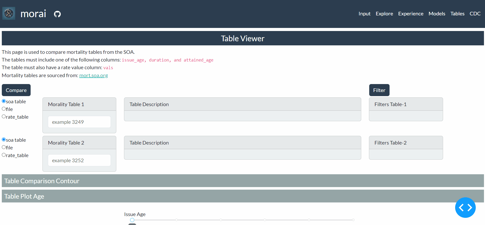
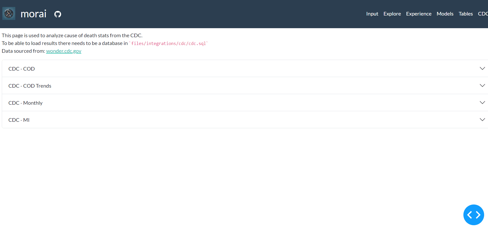

<div align="center">
  <br>
</div>

# Morai

[](https://github.com/jkoestner/morai/blob/main/LICENSE.md)
[](https://codecov.io/gh/jkoestner/morai)
[](https://github.com/psf/black)

## Table of Contents
- [Morai](#morai)
  - [Table of Contents](#table-of-contents)
  - [Overview](#overview)
  - [Installation](#installation)
    - [Local Install](#local-install)
    - [Docker Install](#docker-install)
  - [Usage](#usage)
    - [CLI](#cli)
  - [Other Tools](#other-tools)
    - [Jupyter Lab Usage](#jupyter-lab-usage)
    - [Logging](#logging)
    - [Coverage](#coverage)

## Overview

**📖 Description:**

[Moirai](https://en.wikipedia.org/wiki/Moirai#:~:text=In%20ancient%20Greek%20religion%20and,Moirai) 
in greek mythology are known as the fates. They are personifications of destiny.
The name Morai was chosen as the package is designed to help actuaries review 
mortality and experience data.

**🔬 Jupyter Notebook:**
<!--
these links were created by using the raw file link and then using tinyurl
to create a shortened link.
e.g.
https://github.com/jkoestner/morai/blob/main/notebooks/data_process.ipynb
https://github.com/jkoestner/morai/raw/main/notebooks/data_process.ipynb
https://tinyurl.com/
-->


- [Data Process](https://nbviewer.org/urls/tinyurl.com/morai-data)
- [Exploratory](https://nbviewer.org/urls/tinyurl.com/morai-explore)
- [Predictive Models](https://nbviewer.org/urls/tinyurl.com/morai-predict)
- [GLM Experiments](https://nbviewer.org/urls/tinyurl.com/morai-experiment-glm)

**📊 Dashboard:**

- [Dashboard](https://morai.koestner.fun)
- Data Overview: 
- Data Tables: 
- Data CDC: 

## Installation

### Local Install
To install, this repository can be installed by running the following command in 
the environment of choice.

The following command can be run to install the packages in the pyproject.toml file.

```
uv pip install -e .
```

### Docker Install
The package can also be run in docker which provides a containerized environment, and can host the web dashboard.

```bash
version: "3.8"
services:
  morai:
    image: dmbymdt/morai:latest
    container_name: morai
    command: gunicorn -b 0.0.0.0:8001 morai.dashboard.app:server
    restart: unless-stopped
    environment:
      MORAI_FILES_PATH: /code/morai/files # setting the files path for morai
    ports:
      - '8001:8001'
    volumes:
      - $DOCKERDIR/morai/files:/code/morai/files # mounting the files directory
```

## Usage

### CLI

CLI can be used for easier commands of python scripts for both portfolio or manager. An example of a CLI command is shown below. When running the dashboard the `MORAI_FILES_PATH` environment variable needs to be set to the directory where the files are stored.

```commandline
morai dashboard
```

It also can be run locally by going to the dashboard folder and running below.

```python
python -m morai.dashboard.app
```

## Other Tools
### Jupyter Lab Usage

To have conda environments work with Jupyter Notebooks a kernel needs to be defined. This can be done defining a kernel, shown below when
in the conda environment.

```
python -m ipykernel install --user --name=morai
```

If plotly images are not showing in the default set up there may need to be some extensions added to JupyterLab.
The extension particularly needed is the jupyterlab-plotly extension.
This is also discussed more in this issue: [Plotly Issue](https://github.com/plotly/plotly.py/issues/2672)

### Logging

If wanting to get more detail in output of messages the logging can increased
```python
from morai.utils import custom_logger
custom_logger.set_log_level("DEBUG")
```

### Coverage

To see the test coverage the following command is run in the root directory.
```
pytest --cov=morai --cov-report=html
```